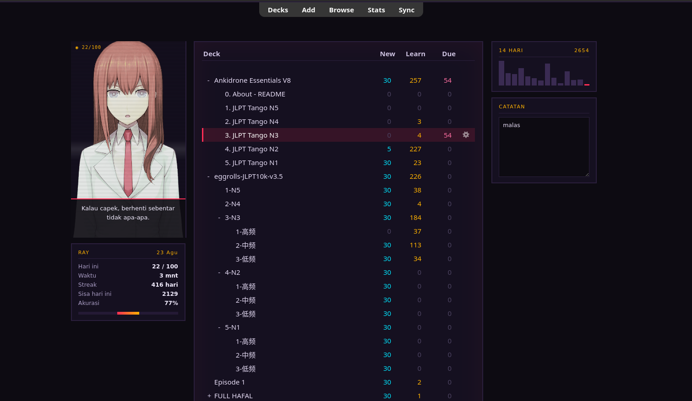

# Amadeus Deck

[Bahasa Indonesia](README-id.md)

An Anki add-on that puts a character on your deck screen and beside your reviews.
She reacts to how the session is going: pleased when you answer well, visibly
irritated when you press Again five times in a row, disappointed when a streak
breaks.

Inspired by Project Amadeus from Steins;Gate 0.



*The character shown is not included — see [Bring your own character](#bring-your-own-character).*

**Your note types are never touched.** No template is edited, nothing is added to
your cards, and the reviewer portrait lives in a Shadow DOM so your card CSS and
the add-on cannot reach each other. Remove the add-on and your collection is
exactly as it was.

---

## Bring your own character

The add-on ships with **no images**. Drop yours into the `character/` folder
inside the add-on directory:

```
<anki data>/addons21/amadeus_deck/character/
```

Name each file so it **ends with a mood and a number**:

```
myoc_happy1.png   myoc_annoyed2.png   myoc_sided_thinking1.png
```

The prefix is free — only the ending matters. Several files per mood is better;
one is picked at random so the same face does not repeat.

**Moods it looks for**

Front-facing: `normal` `happy` `winking` `blush` `disappointed` `sad` `annoyed`
`pissed` `angry` `eyes_closed` `indifferent`

Turned: `side` `sided_pleasant` `sided_thinking` `sided_blush` `sided_worried`
`sided_surprised`

Only `normal` is really required — everything else falls back to it. Check what
you have with:

```
python3 check_character.py
```

It reports which moods are covered, which states would fall back, and whether
your files are consistent in size and transparency.

**Suggested format:** PNG with a transparent background, portrait crop around
454×810, head near the top edge. Mixed sizes make the portrait jump between
expressions.

> Character art is usually somebody else's copyright. That is why none is
> bundled here: what you keep on your own machine is your business, but a
> repository shipping someone's character is a different matter. It also means
> everyone gets to use the character they actually want.

---

## What it adds

**On the deck screen** — a portrait beside your decks, a summary card
(reviews today, time, streak, backlog, accuracy), a bar chart of recent days,
and a daily note that saves itself as you type. The deck list is themed to match
and can scroll instead of growing down the page.

**During review** — the portrait sits in a corner and changes expression as you
answer. Press Again three times in a row and she gets annoyed; five and she tells
you to take a break.

**Two themes** — `vhs` (magenta/cyan, tape tracking lines) and `holo`
(cyan/magenta hologram slices). Both have scanlines and static that can be turned
off.

---

**Lines type themselves out** a character at a time, with an 8-bit talking
blip per syllable -- synthesised, so there is no audio file to ship. Click
mid-sentence to finish the line. Turn either off with `typewriter` and
`dialog_sound` in the config.

## Configuration

Everything is in **Tools → Add-ons → Amadeus Deck → Config**. The whole dialogue
set lives there too, so you can rewrite every line in your character's voice
without touching code:

```json
"lines": {
  "behind": ["Sisa {due}. Baru {done} dari {target}."],
  "target": ["Target {target} tercapai. ...Kerja bagus."]
}
```

Available placeholders: `{due}` `{done}` `{target}` `{streak}`.

Override one state and the rest keep their defaults; delete a state and its
default comes back. A broken placeholder prints literally rather than breaking
the screen.

Notable options: `theme`, `daily_target`, `effects`, `panel_width`,
`panel_height`, `deck_scroll`, `deck_max_height`, `show_stats`, `show_history`,
`show_note`, `show_in_reviewer`, `reviewer_corner`, `reviewer_size`,
`reviewer_always_visible`. Full descriptions are in the Config tab.

---

## Install

**The easy way.** Download
[`AmadeusDeck.ankiaddon`](https://github.com/XnoahR/Amadeus-Deck-Anki/releases/latest/download/AmadeusDeck.ankiaddon)
and double-click it, or in Anki: **Tools → Add-ons → Install from file**.

Then add your images: **Tools → Add-ons → Amadeus Deck → View Files**, drop them
in `character/`, and restart Anki.

**From source.** Copy the folder into your Anki add-ons directory instead:

```
~/.local/share/Anki2/addons21/amadeus_deck              # Linux
~/.var/app/net.ankiweb.Anki/data/Anki2/addons21/...     # Linux, Flatpak
%APPDATA%\Anki2\addons21\amadeus_deck                   # Windows
~/Library/Application Support/Anki2/addons21/...        # macOS
```

Then put your images in `character/` and restart again.

Built against Anki 25.09. Desktop only — the deck screen and reviewer overlay are
injected into Anki's own web views, which AnkiDroid and AnkiMobile do not have.
Your cards sync normally; they simply carry none of this with them.

---

## Known limits

- **Anki updates can break it.** The deck screen is styled by redefining Anki's
  own CSS variables and by wrapping its deck table. Both are internal details
  that upstream may change without warning.
- **Statistics come from `revlog`**, the same table Anki uses, so the numbers
  match Anki's own — including the daily limits. "Backlog" is shown separately
  because the deck list only ever shows the capped number.
- **Effects animate continuously.** On a laptop that costs a little battery.
  `effects: false` turns them off, and `prefers-reduced-motion` is respected
  automatically.

## Licence

MIT for the code. Any character art you add is governed by whatever licence that
art carries.
